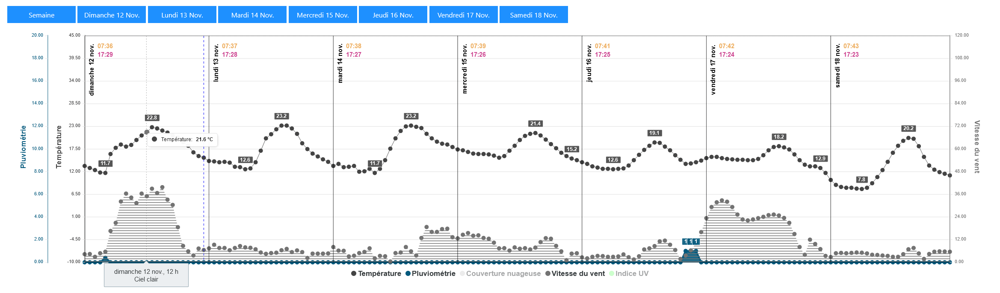

# Météo
Interface serverless mettant en forme les prévisions météorologiques fournies par l'API d'*[open-meteo.com](https://open-meteo.com/en)*.\
Les prévisions étant mises à jour toutes les trois heures, le résultat de chaque ville est stocké dans le *localstorage* du navigateur pour être réutilisé pendant une heure — au-delà de quoi une nouvelle requête écrasera l'ancien résultat.

**Météo** est utilisable à cette adresse : https://philjbt.github.io/Meteo/

Prévisions disponibles :
- Lever du soleil
- Coucher de soleil
- Température à 2 mètres du sol
- Précipitation
- Couverture nuageuse
- Vitesse du vent à 10 mètres du sol
- Code météorologique
- Indice UV [^1]

[^1]: Disponible uniquement pendant la saison pollinique, avec une prévision de 4 jours.
